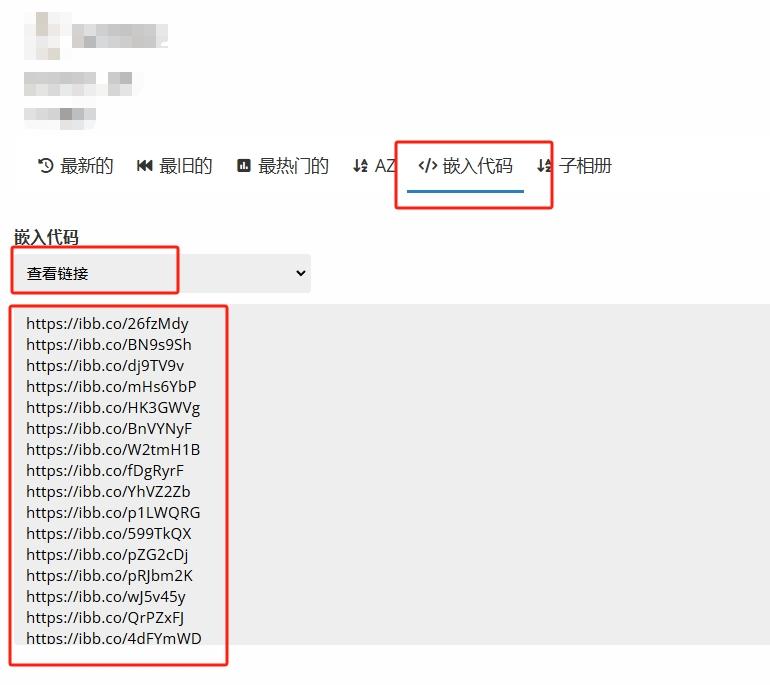

# Imgbb Downloader Imgbb下载器 自动批量下载Imgbb相册原图 #
## 操作方法 ##
1.在Imgbb中，打开相册后点击嵌入代码，在下拉框中选择查看链接，复制所有链接。

2.运行程序，如果初次运行在弹出的第一条对话中选择否，粘贴所有链接，Ctrl+D确认，程序将自动提取原图链接并下载。当程序输出“所有文件下载成功！”时，表示下载完成。

3.如果下载被迫中断，请重新运行程序，在弹出的第一条对话中选择是，程序将自动继续上次的下载。

4.在面对可能的网络问题时，程序采用无限循环的方式重试下载。请放心，出现网络问题是正常的，如果您的网络可以正常访问Imgbb，则不用在意程序输出的失败信息，大多数情况都不会一次全部下载成功，程序会自动重试并完成下载。但如果程序的运行时间大幅超出了可能的预估值，或输出的失败文件个数一直不减少，请关闭程序并检测设备的网络是否出现问题。

## 为什么选择此软件 ##
一些比较通用爬虫程序也可以下载在Imgbb的图片，但网站上显示的默认都是缩略图，爬虫程序无法下载原图。而本软件针对Imgbb网站HTML结构爬取的是原图链接，而不是展示的图片。
