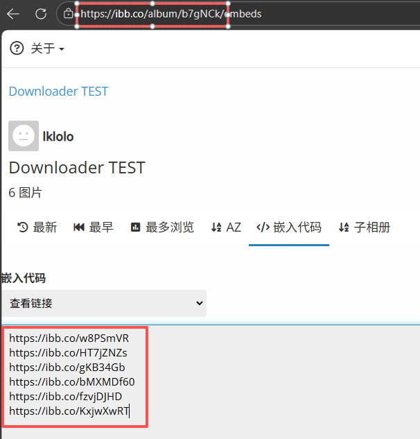
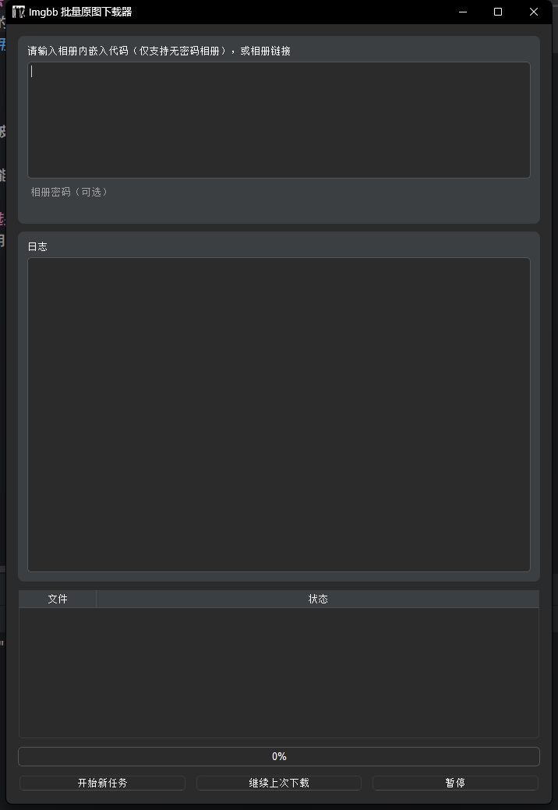

# Imgbb Downloader Imgbb下载器 自动批量下载Imgbb相册原图 #
## 操作方法（GUI版本 ##
1.复制相册的链接（上方红框） 或 相册中嵌入代码-查看链接中每张图片的链接（下方红框）。

2.将链接粘贴到上方输入框，点击最下方的开始新任务。如果相册有密码，则只能粘贴相册链接，并需要填入正确的密码。

3.如果出现time out等错误提示，请重试。
## 为什么选择此软件 ##
一些比较通用爬虫程序也可以下载在Imgbb的图片，但网站上显示的默认都是缩略图，爬虫程序无法下载原图。而本软件针对Imgbb网站HTML结构爬取的是原图链接，而不是展示的图片。
