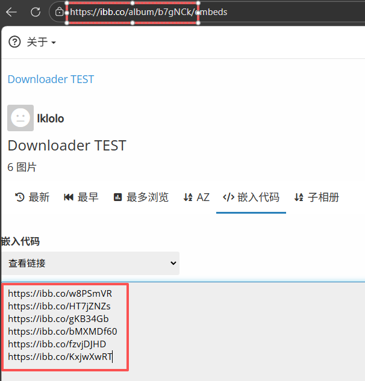
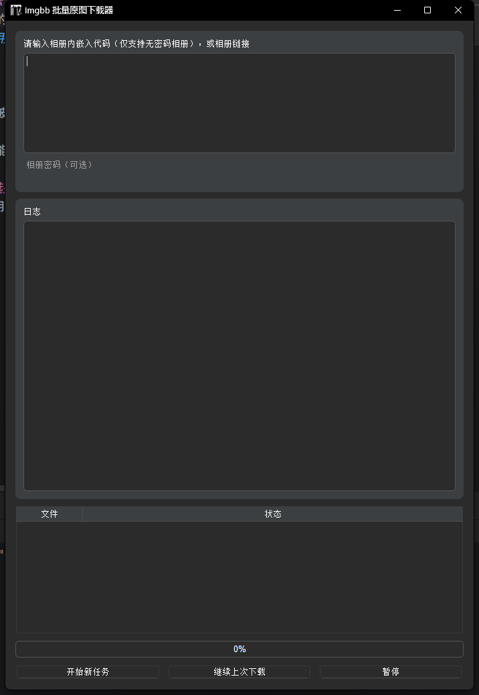

# ImgBB Downloader | 原图批量下载器

专为 ImgBB 打造的深度解析工具，彻底解决通用爬虫只能抓取缩略图的痛点。

---

## ✨ 核心优势：为什么选择本软件？

市面上绝大多数通用爬虫仅能识别网页表层的 `` 标签，下载到的往往是 **缩略图 (Thumbnails)**。

**本软件的独特之处：**
* **深度解析：** 针对 ImgBB 网站 HTML 结构进行底层适配，直接定位并提取 **原始高清文件**。
* **无损获取：** 绕过预览层，确保下载的每一张图片都是原图。
* **现代交互：** 基于 **PyQt6** 开发，采用简约、现代的 GUI 设计，操作直观且响应迅速。

---

## 🛠️ 操作指南

### 1. 获取链接
复制 **相册链接** 或 **图片查看链接**（如下图红框所示）。支持批量粘贴。

### 2. 建立任务
将链接粘贴至软件上方的输入框，点击 **[开始新任务]**。
* **注意：** 若相册设有访问密码，请务必在密码栏填入正确信息，否则无法解析。

### 3. 异常处理
* 解析过程中如遇 `Time Out`（超时）等网络波动提示，请尝试重试。

---

## 🏗️ 技术亮点
* **精准嗅探：** 针对 ImgBB 动态页面结构的自研解析引擎。
* **多模块化：** 独立的设置区、链接输入区、下载展示区及实时日志监控。
* **高性能：** 异步处理下载请求，任务状态一目了然。

---

## ⚖️ 免责声明
本工具仅供技术交流与个人学习使用。请尊重图片版权所有者的权益，并遵守 ImgBB 平台的相关服务条款。

---